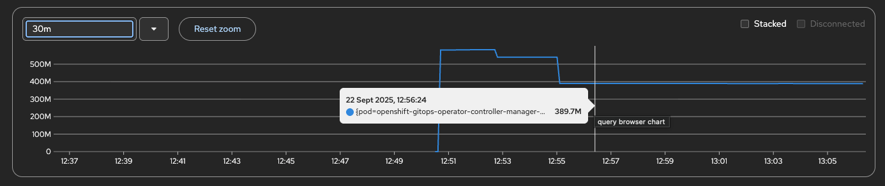
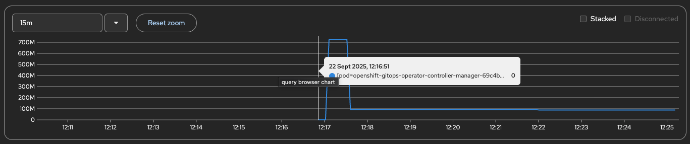

# Controller Runtime Cache Transform for Secrets and ConfigMaps

This proposal outlines an approach to reduce memory consumed by the operator’s manager pod by stripping data fields from Secrets and ConfigMaps stored in controller-runtime’s cache when they are not tracked or required by the operator.

## Problem

We recently discovered that the Argo CD Operator consumes significantly more memory on large clusters, particularly those with a high number of Secrets and ConfigMaps. For example, in a test cluster with 2,000 Secrets and 2,000 ConfigMaps spread across 100 namespaces, the operator manager pod consumed over 2 GB of memory at peak, with just one Argo CD CR instance.

Upon further investigation, we found that the primary contributor to this high memory usage is the underlying controller-runtime object cache, which the operator uses to watch resources.

### Why Does This Happen?

By default, controller-runtime caches all objects of a given type when **a watch is registered** for that type.

For example, even if we add a watch only for Secrets owned by the operator:
```go
// Watch for changes to Secrets sub-resources owned by ArgoCD instances.
bldr.Owns(&v1.Secrets{})
```
controller-runtime will still cache **all Secrets in the cluster**, not just the operator-owned ones. This results in excessive memory usage on large clusters with many resources.

Ideally, the operator should cache only the resources it needs. To achieve this optimization, we explored various caching options available in controller-runtime.

## Proposed Solution

At a high level, this proposal suggests:
- Use a labels to identify operator-owned/tracked/required resources.
- Strip unnecessary fields from non-operator objects before storing them in the controller-runtime cache.
- Introduce a self-healing mechanism that automatically labels resources of interest that initially lack the label, ensuring they are cached in full going forward.

### Implementation

1. Cache Transform  
    Apply a transform on Secrets and ConfigMaps:
    - For non-operator objects, strip heavy fields (data, stringData, binaryData).
    - For operator-tracked objects (identified by labels like `operator.argoproj.io/tracked-by`, `argocd.argoproj.io/secret-type`), retain full content.

    This reduces memory footprint by storing only metadata for irrelevant objects.

2. Client Wrapper  
    Introduce a wrapper around the cached client:
    - On `Get`, if an object looks “stripped” (heuristic: `Data == nil` etc.) or missing required labels → fallback to live client.
    - After a successful live fetch, patch a tracking label so the cache retains the full object in future updates.
    - Errors while patching are non-fatal: subsequent reconciles will retry or fallback to live again.

3. Integration  
    - Wire transforms into `main.go` via `cache.Options.ByObject`.
    - Update reconcilers to use the wrapped client for transparent fallback handling.

### Benefits

- **Reduced memory usage:** Only operator-relevant Secrets/ConfigMaps are cached with full data.
- **Correctness preserved:** Fallback ensures reconciles always see full objects when needed.
- **Self-healing:** Once an object is accessed, it is labeled and cached fully, avoiding repeated live GETs.

## Proof-of-Concept (PoC) Results

These metrics were collected from a test cluster containing **100 ConfigMaps** and **100 Secrets**, each approximately **1 MB** in size. The cluster was running four Argo CD instances and no other workload operators.

With the optimization enabled, operator memory usage dropped from **~350 MB** to **~100 MB**.

UnOptimized Operator Manager Memory:



Optimized Operator Manager Memory:



However, we could not reduce the startup memory consumption, which remained at **~750 MB** in both cases.

We previously attempted another approach in [#1795](https://github.com/argoproj-labs/argocd-operator/pull/1795), but it introduced significant complexity and restricted how watches could be set up. Compared to that, this solution provides a better balance between complexity, maintenance overhead, and outcome.

## Trade-offs / Risks and Mitigations

1. Extra API calls
    - When a resource is stripped in the cache, the operator performs a live lookup.
    - For resources that the operator cares about and are missing the label, this happens only once per resource, since the label is added for future caching.
    - Legitimately empty objects may trigger extra live GETs, but this is rare.

2. External resource labeling
    - The operator supports referencing external ConfigMaps and Secrets in the Argo CD CR.
    - These resources will be labelled. However, adding labels for operator tracking is a widely accepted practice within the Kubernetes community.
    - Additionally, we can provide a feature flag to disable this optimization for users who prefer not to mutate external resources.

## Future scope

- Add metrics for cache hits vs. live fallbacks to measure effectiveness.
- Extend this approach to other resource types once proven stable.