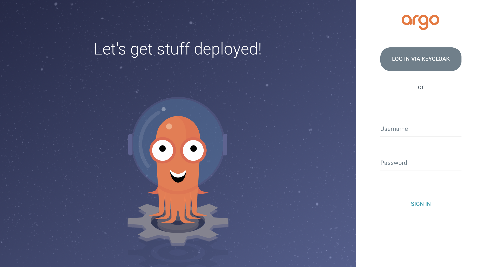

# Usage

This document describes the usage of Keycloak as a Single sign-on provider for ArgoCD.

The following example shows the most minimal valid manifest to create a new Argo CD cluster with keycloak as a Single sign-on provider.

This guide assumes a Kubernetes cluster based on [minikube](https://minikube.sigs.k8s.io/).

## Ingress Controller

Ensure that the `ingress` addon is enabled for the minikube cluster.

The addon is disabled by default, enable it if necessary.

```bash
minikube addons enable ingress
```

Verify that the ingress Pod is running. In this example, the ingress controller is running in the `ingress-nginx` namespace.

```bash
kubectl get pods -A
```

```txt
NAMESPACE           NAME                                                    READY   STATUS    RESTARTS   AGE
ingress-nginx       nginx-ingress-controller-6fc5bcc8c9-vg26z               1/1     Running   0          9h
```

The following example shows the most minimal valid manifest to create a new Argo CD cluster with Keycloak as a Single sign-on provider.

```yaml
apiVersion: argoproj.io/v1alpha1
kind: ArgoCD
metadata:
  name: example-argocd
  labels:
    example: basic
spec:
  sso:
    provider: keycloak
  server:
    ingress:
      enabled: true
    insecure: true
```

If your keycloak is setup with a certificate which is not signed by one of the well known certificate authorities you can provide a custom certificate which will be used in verifying the Keycloak's TLS certificate when communicating with it.
Add the rootCA to your Argo CD custom resource `.spec.sso.keycloak.rootCA` field. The operator reconciles to this change and updates the `oidc.config` in `argocd-cm` configmap with the PEM encoded root certificate.

!!! note
    Argo CD server pod should be restarted after updating the `.spec.sso.keycloak.rootCA`.

Please refer to the below example:

```yaml
apiVersion: argoproj.io/v1alpha1
kind: ArgoCD
metadata:
  name: example-argocd
  labels:
    example: basic
spec:
  sso:
    provider: keycloak
    keycloak:
     rootCA: |
       ---- BEGIN CERTIFICATE ----
       This is a dummy certificate
       Please place this section with appropriate rootCA
       ---- END CERTIFICATE ----
  server:
    ingress:
      enabled: true
```

!!! note
    `.spec.sso.Image`, `.spec.sso.Version`, `.spec.sso.Resources` and `.spec.sso.verifyTLS` fields are no longer supported in Argo CD operator v0.8.0 onwards. Please use equivalent fields under `.spec.sso.keycloak` to configure your keycloak instance.

!!! note
    If you test the operator locally using `make run`, please add `.spec.sso.keycloak.verifyTLS: false` to your Argo CD CR. Specifying conflicting information in both specs will result in errors. 

## Create

Create a namespace for Argo CD.

```bash
kubectl create ns argocd
```

Create a new Argo CD Instance in the `argocd` namespace using the provided example.

```bash
kubectl create -n argocd -f examples/argocd-keycloak-k8s.yaml
```

!!! note
    `verifyTLS` option should be set to `true` if you want to enable strict TLS validation in production. If you are running operator on your machine using `operator-sdk run local`, `verifyTLS` should be set to `false`.

## Keycloak Instance

The above configuration creates a Keycloak instance and its relevant resources along with the Argo CD resources. The default credentials for Keycloak is `admin/admin`.

Get the Keycloak Ingress URL for Login.

```bash
kubectl -n argocd get ingress keycloak
```

```txt
NAME        HOST/PORT     
keycloak    keycloak-ingress  
```

If you running Kubernetes on minikube. Add keycloak hostname to the `/etc/hosts` file on the local machine, which is needed to access the services running locally on minikube.

Run the below commands using **root** user.

```bash
echo "`minikube ip` keycloak-ingress" | sudo tee -a /etc/hosts
```

Make sure an entry for `keycloak-ingress` is added in the `/etc/hosts`.

## Argo CD Login

Get the Argo CD Ingress URL for Login.

```bash
kubectl -n argocd get ingress example-argocd-server
```

```txt
NAME                     HOST/PORT     
example-argocd-server    example-argocd
```

As explained above, add `example-argocd` hostname to the `/etc/hosts` file on the local machine, which is needed to access the services running locally on minikube.

```bash
echo "`minikube ip` example-argocd" | sudo tee -a /etc/hosts
```

Login to Argo CD using the ingress URL. You can see an option to Log in via keycloak apart from the usual ArgoCD login.



Click on **LOGIN VIA KEYCLOAK**.

You can [create keycloak users](https://www.keycloak.org/docs/latest/getting_started/#creating-a-user) by logging in to keycloak admin console using the Keycloak admin credentials and Keycloak Ingress URL.

!!! note
    Keycloak instance takes 2-3 minutes to be up and running. You will see the option **LOGIN VIA KEYCLOAK** only after the keycloak instance is up.

## RBAC

By default any user logged into ArgoCD will have read-only access. User/Group level access can be managed by updating the argocd-rbac-cm configmap.

The below example show how to grant user `foo` with email ID `foo@example.com` admin access to ArgoCD. More information regarding ArgoCD RBAC can be found [here](https://argoproj.github.io/argo-cd/operator-manual/rbac/)

```yaml
policy.csv: |
  g, foo@example.com, role:admin
```

### Uninstall

You can delete the Keycloak resources and its relevant configuration by removing the SSO field from ArgoCD Custom Resource Spec.

Example ArgoCD after removing the SSO field should look something like this.

```yaml
apiVersion: argoproj.io/v1alpha1
kind: ArgoCD
metadata:
  name: example-argocd
  labels:
    example: basic
spec:
  server:
    ingress:
      enabled: true
```
