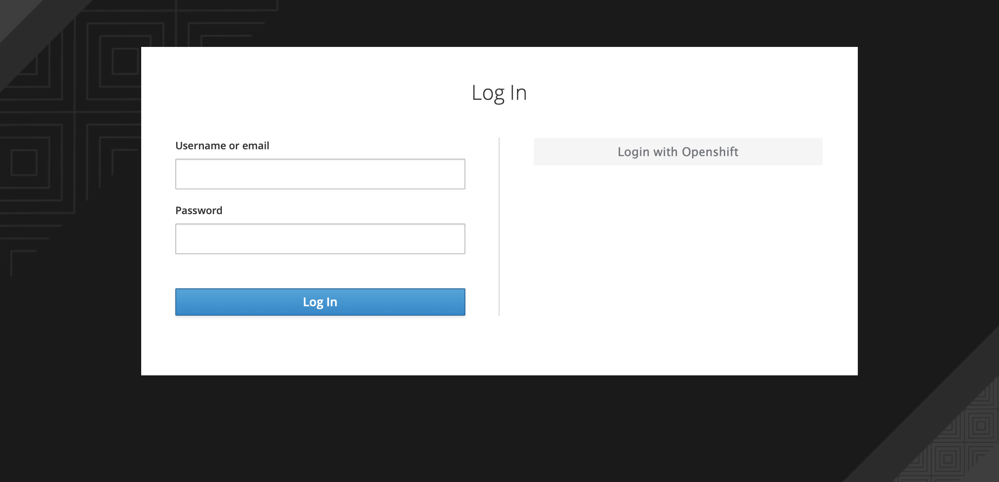
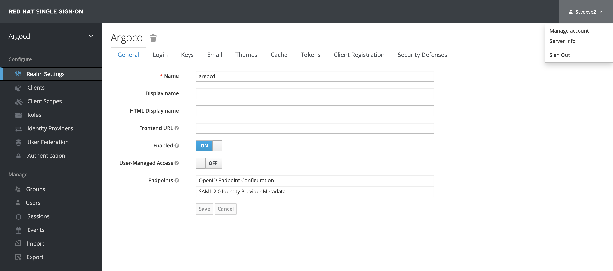
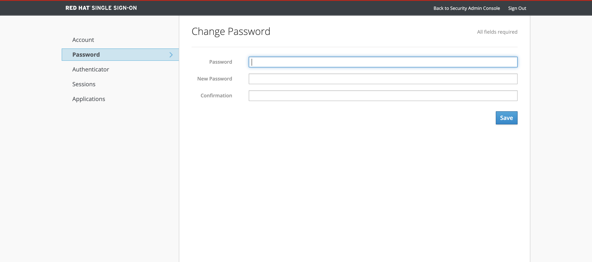

# Usage

This document describes the usage of Keycloak as a Single sign-on provider for ArgoCD in OpenShift Container Platform. Keycloak acts as an Identity broker between ArgoCD and OpenShift, Which means one can also login into Argo CD using their OpenShift credentials.

The following example shows the most minimal valid manifest to create a new Argo CD cluster with keycloak as a Single sign-on provider.

```yaml
apiVersion: argoproj.io/v1alpha1
kind: ArgoCD
metadata:
  name: example-argocd
  labels:
    example: basic
spec:
  sso:
    provider: keycloak
  server:
    route:
     enabled: true
```

If your keycloak is setup with a certificate which is not signed by one of the well known certificate authorities you can provide a custom certificate which will be used in verifying the Keycloak's TLS certificate when communicating with it.
Add the rootCA to your Argo CD custom resource `.spec.sso.keycloak.rootCA` field. The operator reconciles to this change and updates the `oidc.config` in `argocd-cm` configmap with the PEM encoded root certificate.

!!! note
    Argo CD server pod should be restarted after updating the `.spec.sso.keycloak.rootCA`.

Please refer to the below example:

```yaml
apiVersion: argoproj.io/v1alpha1
kind: ArgoCD
metadata:
  name: example-argocd
  labels:
    example: basic
spec:
  sso:
    provider: keycloak
    keycloak:
     rootCA: |
       ---- BEGIN CERTIFICATE ----
       This is a dummy certificate
       Please place this section with appropriate rootCA
       ---- END CERTIFICATE ----
  server:
    route:
      enabled: true
```

!!! note
    `.spec.sso.Image`, `.spec.sso.Version`, `.spec.sso.Resources` and `.spec.sso.verifyTLS` fields are no longer supported in Argo CD operator v0.8.0 onwards. Please use equivalent fields under `.spec.sso.keycloak` to configure your keycloak instance.

## Create

Create a new Argo CD Instance in the `argocd` namespace using the provided example.

```bash
kubectl create -n argocd -f examples/argocd-keycloak.yaml
```

## Keycloak-Instance

The above configuration creates a keycloak instance and its relevant resources along with the Argo CD resources. Users can login into the keycloak console using the below commands.

Get the Keycloak Route URL for Login.

```bash
kubectl -n argocd get route keycloak
```

```bash
NAME   HOST/PORT                                                                PATH   SERVICES   PORT    TERMINATION   WILDCARD
keycloak    keycloak-default.apps.ci-ln-******.origin-ci-int-aws.dev.**.com          keycloak        <all>   reencrypt     None
```

Get the Keycloak Credentials which are stored as environment variables in the keycloak pod.

Get the Keycloak Pod name.

```bash
kubectl -n argocd get pods
```

```bash
NAME                                         READY   STATUS             RESTARTS   AGE
keycloak-1-2sjcl                                  1/1     Running            0          45m
```

Get the Keycloak Username.

```bash
kubectl -n argocd exec keycloak-1-2sjcl -- "env" | grep SSO_ADMIN_USERNAME
```

```bash
SSO_ADMIN_USERNAME=Cqid54Ih
```

Get the Keycloak Password.

```bash
kubectl -n argocd exec keycloak-1-2sjcl -- "env" | grep SSO_ADMIN_PASSWORD
```

```bash
SSO_ADMIN_PASSWORD=GVXxHifH
```

## Login

You can see an option to Log in via keycloak apart from the usual ArgoCD login.


Click on **LOGIN VIA KEYCLOAK**. You will see two different options for login as shown below. The one on the left will allow you to login into argo cd via keycloak username and password. The one on the right will allow you to login into argo cd using your openshift username and password.



You can create keycloak users by logging in to keycloak admin console using the Keycloak admin credentials.

!!! note
    Keycloak instance takes 2-3 minutes to be up and running. You will see the option **LOGIN VIA KEYCLOAK** only after the keycloak instance is up.

## RBAC

By default any user logged into ArgoCD will have read-only access. User level access can be managed by updating the `argocd-rbac-cm` configmap.

### Group Level RBAC

The below example shows how to grant admin access to a group with name `cluster-admins`. More information regarding ArgoCD RBAC can be found [here](https://argoproj.github.io/argo-cd/operator-manual/rbac/)

```yaml
policy.csv: |
  g, cluster-admins, role:admin
```

### User Level RBAC

If you wish to configure RBAC for users instead of groups, consider the below example.
Example shows how to grant admin access to User foobar with email ID `foobar@example.com`. More information regarding ArgoCD RBAC can be found [here](https://argoproj.github.io/argo-cd/operator-manual/rbac/)

```yaml
policy.csv: |
  g, foobar@example.com, role:admin
```

## Change Keycloak Admin Password

You can change the Keycloak Admin Password that is created by the operator as shown below.

Login to the Keycloak Admin Console using the Admin user as described in the above section. Click on the user drop-down at the top right and click on the `Manage Account`.



Click on the `Password` tab to update the Keycloak Admin Password.



## Uninstall

You can delete the Keycloak resources and its relevant configuration by removing the SSO field from ArgoCD Custom Resource Spec.

Example ArgoCD after removing the SSO field should look something like this.

```yaml
apiVersion: argoproj.io/v1alpha1
kind: ArgoCD
metadata:
  name: example-argocd
  labels:
    example: basic
spec:
  server:
    route:
     enabled: true
```

Note: Keycloak application created by this feature is currently not persistent. Incase of restarts, Any additional configuration created by the users in ArgoCD Keycloak realm will be deleted.
